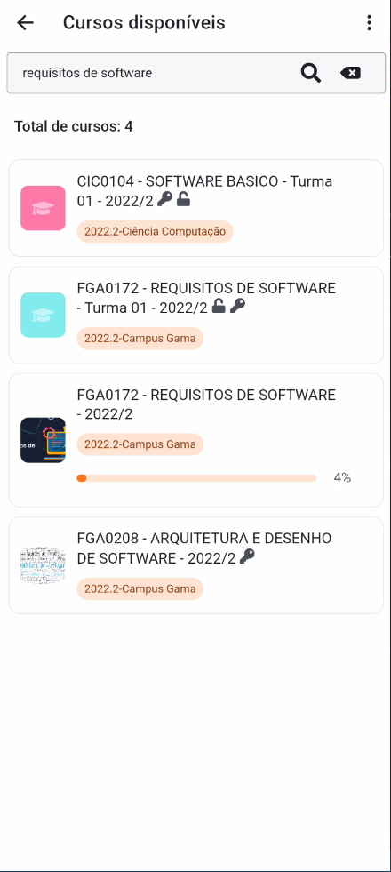
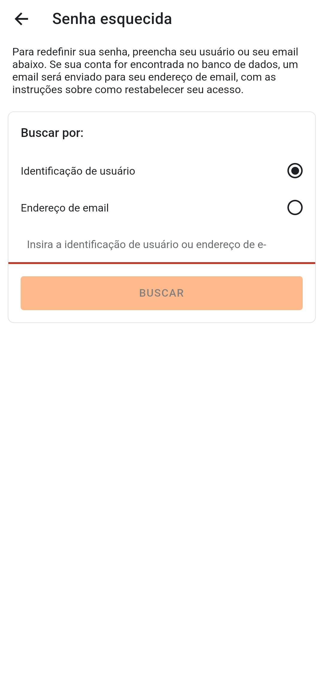
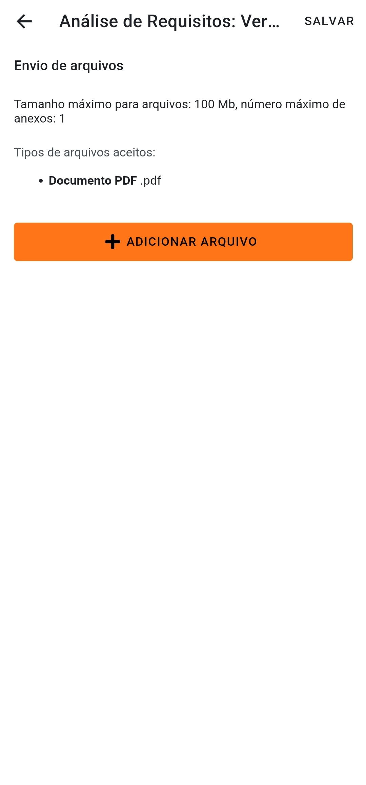
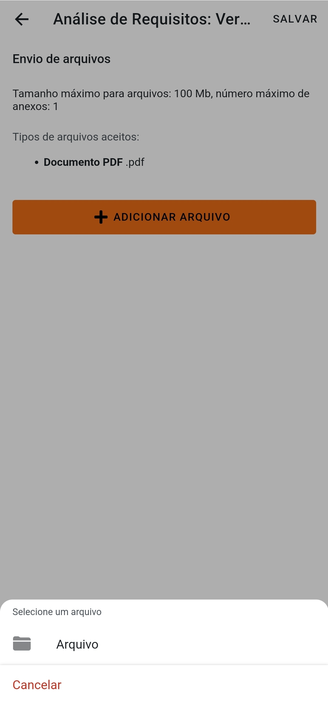

# Validação

## 1. Introdução

&emsp;&emsp;O processo de validação de um software é uma etapa importante na criação de um produto de qualidade. Ele consiste em verificar se o software atende aos requisitos e expectativas estabelecidos, bem como se está funcionando de forma adequada. 

&emsp;&emsp;O objetivo da validação é garantir que o software seja confiável e seguro para os usuários finais. É importante realizar a validação de forma sistemática e documentada, para garantir a qualidade do produto final.

## 2. Metodologia
&emsp;&emsp;Para validar os requisitos do aplicativo Moodle (Referente ao grupo 7) foram verificados se os requisitos levantados estão implementados no aplicativo. Logo abaixo podemos ver quais requisitos foram validados o feedback e as imagens referênte a cada requisito validado comprovando o seu funcionamento.
### 2.1 Requisitos avaliados

- [RF09](https://requisitos-de-software.github.io/2022.2-Moodle/Elicitacao/requisitos/#RF09) - O sistema deve permitir pesquisar disciplina por nome.
- [RF34](https://requisitos-de-software.github.io/2022.2-Moodle/Elicitacao/requisitos/) - O aluno deve ser capaz de recuperar a senha.

## 3. Validação dos Requisitos

### 3.1 RF09 - O usuário deve ser capaz de excluir um canal.

&emsp;&emsp;A figura abaixo mostra o requisito funcional implementado RF09: O sistema deve permitir pesquisar disciplina por nome. A figura lista as matérias que foram encontradas a partir da busca "requisitos de software"

Figura 1: Pesquisa por nome da disciplina

Fonte: Josué Teixeira

&emsp;&emsp;<b>Feedback:</b> A funcionalidade cumpre com o que promete, entretanto, ela não apresenta precisão na busca. Por exemplo, na figura acima foi realizada uma busca pela matéria requisitos de software e apareceu matérias não condizentes com a minha busca.

### 3.2 RF34 - O aluno deve ser capaz de recuperar a senha.

&emsp;&emsp;A figura abaixo mostra o requisito funcional implementado RF34: O aluno deve ser capaz de recuperar a senha. A figura 2 mostra a primeira tela em que o usuário pode escolher qual a melhor forma de recuperar a senha. A figura 3 apresenta a mensagem de sucesso ao enviar um pedido de recuperação de senha.

Figura 2 e 3: Tela de senha esquecida e tela de sucesso na requisição 

Fonte: Josué Teixeira

&emsp;&emsp;<b>Feedback:</b> A funcionalidade funciona corretamente. Ela possui mais de uma opção de escolha para recuperar senha o que facilita e abre mais opções para o usuário escolher a melhor forma de recuperação de senha.

### 3.3 RF12 - O sistema deve permitir a inserção de arquivos para envio das atividades.

&emsp;&emsp;A figura abaixo mostra o requisito funcional implementado RF12: O sistema deve permitir a inserção de arquivos para envio das atividades. A figura mostra que é possível adicionar arquivos para envio das atividades.

Figura 4 e 5: Tela de adicionar arquivo e Tela de busca pelo arquivo

Fonte: Josué Teixeira

&emsp;&emsp;<b>Feedback:</b> O requisito está implementado no aplicativo. Ele funciona perfeitamente, após clicar no botão "adicionar arquivo" ele apresenta uma opção para selecionar um arquivo que está presente no dispositivo. Acredito apenas que poderia apresentar uma opção para travar o envio para um tipo de arquivo específico. 

## 5. Referências

> - Milene Serrano, Requisitos - Aula 23. Acesso em: 14 de agosto de 2022. Disponível em: Aprender3.
> - Jacinta Pereira e  Rossana Andrade, Processos de Engenharia de
Requisitos. Acesso em: 16 de agosto de 2022. Disponível em: [Processos de Engenharia de
Requisitos](http://disciplinas.lia.ufc.br/engsof081/arquivos/ProcessosEngRequisitos-v2.pdf).

## 5. Histórico de Versão

| Versão | Data | Descrição | Autor | Revisor |
| :----: | :--: | :-------: | :---: | :-----: |
| 1.0 | 08/01/2023 | Criação do arquivo e também da primeira validação de requisito | [Josué Teixeira](https://github.com/zjosuez)  | [Abdul Hannan](https://github.com/hannanhunny01), [Thiago Vivan Bastos](https://github.com/thiago-vivan) |