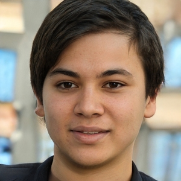

# Personas

## 1. Introdução

&emsp;&emsp;Uma persona é um personagem fictício, arquétipo hipotético de um grupo de usuários reais, criada para descrever um usuário típico. As personas são definidas principalmente por seus objetivos, que são determinados num processo de refinamentos sucessivos durante a investigação inicial do domínio de atividade do usuário. A partir disso, foi projetado um elenco de personas e uma anti-persona para descrever usuários típicos do StarPlus. 
&emsp;&emsp;
## 2. Formação do Elenco de Persona e Anti-Persona

&emsp;&emsp;O Elenco e a quantidade de personas foi definido após uma reunião com os integrantes do grupo. A quantidade de personas foi definido de forma que todos os perfis de usuários fossem devidamente representados, tanto jovens, quanto pessoas mais experiêntes, com muito ou pouco conhecimento em tecnologia. Resultando em três personas(tabelas 1 a 3) e uma anti-persona(tabela 4). As personas criadas estão representadas nas tabelas logo abaixo. As imagens utilizadas foram obtidas do site ThisPersonDoesNotExist um site que gera imagens sem direitos autorais.

## 3. Personas
### 3.1 Pedro Miguel Santos
<figcaption style="font-size: 15px; text-align: center">Fonte: Josué Teixeira</figcaption>

|     |    |
| :-: | :- |
| **Foto** | <figcaption style="font-size: 13px">Figura 1: Pedro Miguel Santos</figcaption> </figcaption>  <figcaption style="font-size: 13px">Fonte: ThisPersonDoesNotExist |
| **Nome** | Pedro Miguel Santos |
| **Ocupação** | Estudante do Ensino Médio |
| **Dados Demográficos** | 17 anos. Solteiro. Sexo Masculino. Mora com os pais em Samambaia. |
| **Status** | Persona primária |
| **Objetivo** | Conseguir assistir os principais filmes e as séries da atualidade. |
| **Habilidades e Tarefas** | Pedro Miguel é estudante do ensino médio e apaixonado por filmes e séries. Pedro sempre gostou de assistir filmes e séries e passa a maior parte do seu tempo em frente ao computador assistindo os principais titulos da atualidade. Ele tem poucos amigos, mas adora passar o tempo com eles conversando sobre filmes, séries e jogos.  Principais tarefas: - Assistir filmes e séries diariamente. - Organizar a casa. - Estudar um pouco todos os dias.  |
| **Ambiente** | Pedro mora com os pais, mas passa a maior parte do tempo sozinho porque seus pais trabalham o dia todo. As vezes vai na casa dos seus amigos depois que termina a aula para jogar ou realizar as atividades escolares. |
| **Requisitos** | Pedro Miguel espera conseguir assitir os principais títulos da atualidade em qualidade 4K. |
| **Expectativas** | Pedro Miguel tem a expectativa de conseguir assistir os filmes/séries favoritos sem problemas na plataforma. |

  <figcaption style="font-size: 15px; text-align: center">Tabela 1: Pedro Miguel Santos</figcaption>

### 3.2 Ana Júlia Fogaça
<figcaption style="font-size: 15px; text-align: center">Fonte: Josué Teixeira</figcaption>

|     |    |
| :-: | :- |
| **Foto** | <figcaption style="font-size: 13px">Figura 2: Ana Júlia Fogaça</figcaption>  </figcaption>  <figcaption style="font-size: 13px">Fonte: ThisPersonDoesNotExist |
| **Nome** | Ana Júlia Fogaça |
| **Ocupação** | Estudante de Jornalismo na Universidade de Brasília (UnB) |
| **Dados Demográficos** | 22 anos. Solteira. Sexo Feminino. Mora com os pais e dois irmãos em Taguatinga. |
| **Status** | Persona secundária |
| **Objetivo** | Conseguir assistir filmes com sua família. |
| **Habilidades e Tarefas** | Ana Júlia é focada e gosta de estudar. Faz estágio em uma emissora de TV, produzindo conteúdo sobre os principais times de futebol do mundo. Adora praticar atividade física em uma academia perto do trabalho, e sempre que pode, passa o tempo com sua família assistindo filmes de romance.  Principais tarefas: - Estudar um pouco todo dia para realizar as atividades e provas da faculdade. - Fazer atividade física diariamente para exercitar o corpo. - Assistir filmes com sua família. |
| **Ambiente** | Ana Júlia mora com seus pais e adora passar o tempo livre com sua família. Ela não é muito de sair de casa, mas as vezes se encontra com sua amiga que mora na casa ao lado. |
| **Requisitos** | Ana Júlia adora assistir filmes de romando, então ela espera conseguir assistir os principais títulos de filme do gênero romance. |
| **Expectativas** | Ana Júlia tem a expectativa de assistir filme com sua família. |

  <figcaption style="font-size: 15px; text-align: center">Tabela 2: Ana Júlia Fogaça</figcaption>

### 3.3 João Guilherme Santos

  <figcaption style="font-size: 15px; text-align: center">Fonte: Josué Teixeira</figcaption>

|     |    |
| :-: | :- |
| **Foto** | <figcaption style="font-size: 13px">Figura 3: João Guilherme Santos</figcaption> </figcaption>  <figcaption style="font-size: 13px">Fonte: ThisPersonDoesNotExist |
| **Nome** | João Guilherme Santos |
| **Ocupação** | Engenheiro Civil |
| **Dados Demográficos** | 45 anos. Casado. Sexo Masculino. Mora com sua esposa e seus 2 filhos na Asa Norte. |
| **Status** | Persona secundária |
| **Objetivo** | Conseguir assistir documentários sobre a vida animal. |
| **Habilidades e Tarefas** | João Guilherme é Doutor em Engenharia Civil e trabalha na MRV, empresa de construção civil. João é escritor e tem 4 livros de sua autoria sobre engenharia e inovação. Passa a maior parte do dia no seu trabalho, mas ao final do dia, pratica atividade física com sua esposa. Aos finais de semana ele gosta de ficar em casa e as vezes assiste documentários, principalmente sobre a vida animal.  Principais tarefas: - Escreve seus livros diariamente antes de dormir. - Gosta de praticar atividade física. - Assiste documentários no tempo livre.  |
| **Ambiente** | João Guilherme passa a maior parte do dia no trabalho com seus colegas, ele conhece muitas pessoas e tem uma rede de amizade muito grande. Sempre dedica um tempo para passar com sua esposa, principalmente aos finais de semana. |
| **Requisitos** | João espera assistir documentários sobre a vida animal com áudio e vídeo em português. |
| **Expectativas** | João tem a expectativa de assistir documentários no seu tempo livre. |
<figcaption style="font-size: 15px; text-align: center">Tabela 3: João Guilherme Santos</figcaption>

## 4. Antipersona
### 4.1 Maria Alice da Luz
<figcaption style="font-size: 15px; text-align: center" >Fonte: Josué Teixeira</figcaption>

|     |    |
| :-: | :- |
| **Foto** | <figcaption style="font-size: 13px">Figura 4: Maria Alice da Luz</figcaption> </figcaption>  <figcaption style="font-size: 13px">Fonte: ThisPersonDoesNotExist |
| **Nome** | Maria Alice da Luz |
| **Ocupação** | Médica Veterinária |
| **Dados Demográficos** | 66 anos. Viúva. Sexo Feminino. Mora sozinha em Vicente Pires. |
| **Status** | Antipersona |
| **Habilidades e Tarefas** | Maria Alice é médica veterinária especialista no tratamento de animais silvestres, e trabalha no Centro de Triagem de Animais Silvestres (Cetas) do Ibama. Maria adora assistir jornais e novelas, principalmente no horário do almoço e à noite, quando chega em casa. Ela não tem muita afinidade com tecnologia e usa um celular do modelo mais antigo, porque é mais simples de usar.  Adora visitar seus filhos que moram em São Paulo e passar um tempo com seus 2 netos.  Principais tarefas: - Realiza pesquisas diariamente sobre os animáis silvestres que estão no território brasileiro. - Assiste novela todos os dias. - Passa um tempo com seus filhos e netos quando consegue.  |
| **Ambiente** | Maria passa grande parte do dia com seus colegas de trabalho, é acostumada a viajar à trabalho para examinar animais e está sempre em contato com novas pessoas. Tem costuma de viajar para São Paulo para visitar seus filhos e ver seus netos. |
| **Requisitos** | Como Maria não utiliza plataformas de streming, não foi definido nenhum requisito baseado nos dados sobre ela. |
| **Expectativas** | Maria não tem expectativas em relação ao aplicativo porque não costuma assistir filmes/séries/documentarios. |

<figcaption style="font-size: 15px; text-align: center ">Tabela 4: Maria Alice da Luz</figcaption>

## 4. Referências

> - Youtube. Acesso em: 29 de jun. de 2022. Disponível em: https://about.youtube/
> - ThisPersonDoesNotExist. Acesso em: 04 de jul. de 2022. Disponível em: https://thispersondoesnotexist.com/image
> - Maurício Vianna, Design Thinking - Inovação em Negócios. Rio de Janeiro, 1a Edição, MJV Press, 2012.
> - usability.gov. Acesso em: 05 de jul. de 2022. Disponível em: https://www.usability.gov/how-to-and-tools/methods/personas.html
## 5. Histórico de versão

|Versão|Data|Descrição|Autor|Revisor|
| ------ | ---------- | ----------------------------------------- | ------------ | --------- |
| 1.0 | 28/11/2022 | Adicionando Personas e Antipersona | [Josué](https://github.com/zjosuez) | [Gabriel Roger](https://github.com/GabrielRoger07)
| 1.1 | 29/11/2022 | alterado: dimensão das imagens; adicionado: referências e conteudo do tópico 2  | [Josué](https://github.com/zjosuez) | [Gabriel Roger](https://github.com/GabrielRoger07)
| 1.2 | 30/11/2022 | ajustando informação da persona | [Gabriel Roger](https://github.com/GabrielRoger07) | [Josué](https://github.com/zjosuez)
| 1.3 | 07/12/2022 | alterado: Incrementado alguns dados sobre a formação do elenco; Atualizado atividades da persona  | [Josué](https://github.com/zjosuez) | [Gabriel Roger](https://github.com/GabrielRoger07)
| 1.4 | 03/01/2023 | adicionado informações sobre o elenco; separado requisitos das expectativas; adicionado fonte as imagens e tabelas | [Josué](https://github.com/zjosuez) | [Gabriel Roger](https://github.com/GabrielRoger07)
| 1.5 | 05/01/2023 | ajustade na legenda das tabelas | [Josué](https://github.com/zjosuez) | [Gabriel Roger](https://github.com/GabrielRoger07)
