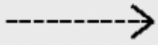

# NFR Framework
## Introdução
O NFR Framework é uma abordagem para representar e analisar Requisitos Não-Funcionais. Tem como principal objetivo auxiliar os desenvolvedores no processo de implantação de soluções personalizadas com a perspectiva das características do domínio e do sistema em questão.Essas características incluem os Requisitos Não-Funcionais, Requsitos Funcionais, prioridades e carga de trabalho. Os Requisitos Não-Funcionais são considerados cidadãos de primeira ordem. O Framework trabalha com o conceito de softgoals, e possui um método de análise quantitativa para definir os status dos softgoals.

## Softgoals
Um softgoal é um objetivo que não tem definição clara nem critérios de aceitação precisos. São utilizados para representar Requisitos Não-Funcionais e podem estar inter-relacionados, indicando a influência de um softgoal em outro.

Para representar essa interdependência, usa-se um Softgoal Interdependency Graph (SIG). Esses gráficos armazenam um registro completo de todas as decisões de desenvolvimento e da lógica do projeto de forma gráfica e concisa, incluindo os Requisitos Não-Funcionais e suas alternativas, decisões e justificativas.

Existem três tipos de softgoals, e cada um deles possui uma notação gráfica associada.

Tabela1: Legenda dos diagramas

| Imagem                                                                  | Legenda                                 |
| :---------------------------------------------------------------------- | :-------------------------------------- |
|  | Softgoal de NFR |
|  | Softgoal de Operacionalização |
|  | Softgoal de Afirmação |
|  | Crítico |
|  | Aceito |
|  | Negado |
|  | Implícito |
|  | Explícito |
|  | Muito Satisfeito |
|  | Satisfeito |
|  | Insatisfeito |
|  | Muito Insatisfeito |

 Fonte: Josué Teixeira 

## 2. Metodologia
  Através desse documento, buscamos definir as funcionalidades dos requisitos não-funcionais através da implementação de diagramas, representados nas Imagens 1 a 7, utilizando o NFR Framework, criando análises das possíveis situações.

## 3. Requisitos não funcionais
  Abaixo, na Tabela 2, estão os requisitos não-funcionais levantados através das técnicas de elicitação utilizadas no projeto, sendo os mesmo utilizados para elaboração do NFR Framework.
 

Tabela 2: Requisitos não-funcionais selecionados

|Número|Requisito|Técnica|
|----|----|----|
|RFN4|O sistema deve ser responsivo	|Brainstorm, Questionário|
|RNF5|O sistema deve ser multiplataforma|Questionário|
|RNF6	|O sistema deve possuir uma boa conexão com o servidor	|Observação, Brainstorm|
|RNF9|O sistema deve suportar o acesso simultâneo de mais de um perfil do mesmo usuário	|Introspecção|

Fonte: Josué Teixeira

## Diagramas
### Geral

Imagem 1: Diagrama geral NFR

Fonte: Abdul Hannan

### Disponibilidade

Imagem 2: Diagrama Disponibilidade NFR

 

Fonte: Abdul Hannan

 

Imagem 3: Diagrama Disponibilidade NFR - StarPlus (Autoria - Abdul Hannan)

Fonte: Abdul Hannan

### Segurança

Imagem 4: Diagrama Segurança NFR - StarPlus (Autoria - Abdul Hannan)
 

Fonte: Abdul Hannan

 

Imagem 5: Diagrama Segurança NFR - StarPlus (Autoria - Abdul Hannan)

Fonte: Abdul Hannan

### Usabilidade

Imagem 6: Diagrama Usabilidade NFR - StarPlus (Autoria - Abdul Hannan)
 

Fonte: Abdul Hannan

 

Imagem 7: Diagrama Usabilidade NFR - StarPlus (Autoria - Abdul Hannan)

Fonte: Abdul Hannan

## Referências
Reinaldo Antônio da Silva. "NFR4ES: Um Catálogo de Requisitos Não-Funcionais para Sistemas Embarcados". Universidade Federal de Pernambuco, 2019.

## Histórico de versão
|Versão|Data|Descrição|Autor|Revisor|
|-|-|-|-|-|
|1.0|03/01/2023|Criação do documento| [Abdul Hannan](https://github.com/hannanhunny01), [Thiago Vivan Bastos](https://github.com/thiago-vivan), [Josué Teixeira](https://github.com/zjosuez)|[Gabriel Roger](https://github.com/GabrielRoger07), [João Pedro de Camargo Vaz](https://github.com/JoaoPedro0803), [Vinícius Assumpção](https://github.com/viniman27)|
|1.1|04/01/2023|Adicionado tabela com as legendas, legendas das imagens e tabelas e correção ortográfica| [Josué Teixeira](https://github.com/zjosuez)|[Abdul Hannan](https://github.com/hannanhunny01), [Thiago Vivan Bastos](https://github.com/thiago-vivan)|
